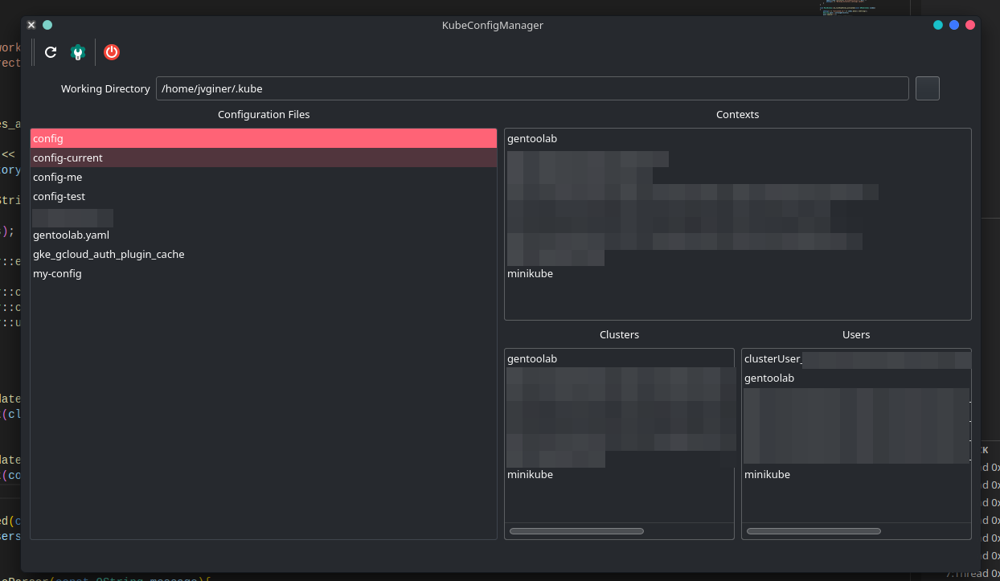

# KubeConfigManager
A tool to merge and manage kubernetes configuration files

> **This is a work in progress for now, not intended to be used**

## Current libraries or tools used
* https://github.com/WillBrennan/yaqti
* https://github.com/jbeder/yaml-cpp
